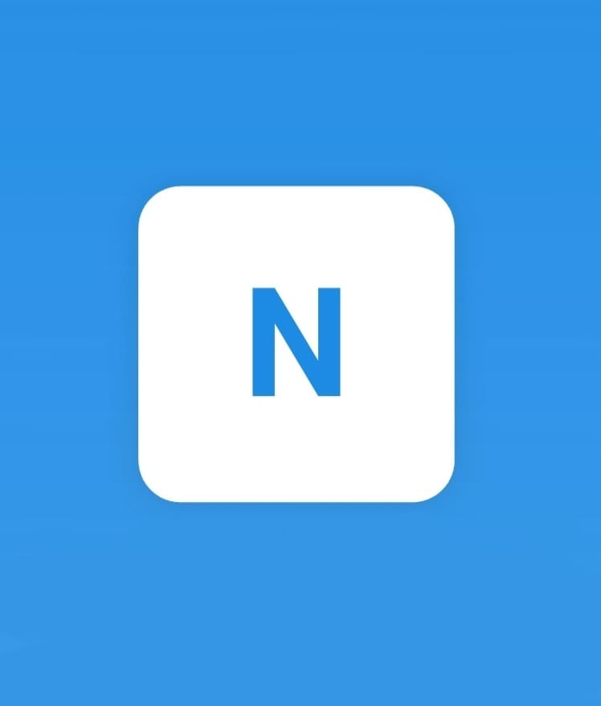

<div align="center">



# 🚗 Nuvia — Car Rental App

### *Rent smarter. Drive better. No deposits, no hassle.*

[](https://flutter.dev)
[](https://dart.dev)
[](https://firebase.google.com)
[](https://developers.google.com/maps)
[](https://stripe.com)
[](https://flutter.dev)

</div>

---

## 📖 About Nuvia

**Nuvia** is a modern, full-featured **car rental mobile application** built with Flutter, designed to revolutionize the traditional rental experience. Starting in Cairo, Nuvia allows users to browse, filter, and book vehicles instantly — with on-demand delivery, no security deposit, and a fully digital process from search to payment.

Built as a graduation project at **Sadat Academy for Management and Sciences**, Nuvia demonstrates a production-grade mobile architecture integrating Firebase, Google Maps, Stripe payments, and real-time chat — all within a clean, glassmorphism-inspired UI.

---

## 🚀 Key Features

- 🔐 **Secure Authentication** — Firebase Auth with email/password login, document upload for ID verification, and session management
- 🚘 **Vehicle Search & Filtering** — Browse cars by type, location, price range, and features with a smooth, responsive UI
- 📅 **Full Booking Flow** — Select rental duration, pickup/drop-off points, and complete booking in a few taps
- 💳 **Integrated Payments** — Stripe-powered secure payment gateway supporting cards and e-wallets (PCI-DSS compliant)
- 🗺️ **Location-Based Services** — Google Maps integration for finding nearby cars, setting pickup/drop-off points, and real-time navigation
- 💬 **In-App Chat Support** — Real-time messaging between renters and support agents via Twilio API
- 🔔 **Push Notifications** — Booking confirmations, delivery updates, and promotions via Firebase Cloud Messaging
- 📁 **Document Management** — In-app upload for driver's license and national ID using file picker
- 🕐 **Rental History & Tracking** — View active and past rentals with real-time status updates from Cloud Firestore
- 🎨 **Premium UI/UX** — Glassmorphism design language, dark mode support, smooth animations, and card-based layouts
- 📱 **Fully Responsive** — Pixel-perfect layouts across all screen sizes using `flutter_screenutil`
- ✨ **Polished Animations** — Entrance effects and transitions powered by `animate_do` and `flutter_animate`
- ⚡ **Shimmer Loading States** — Skeleton screens for a seamless, non-blocking loading experience
- 🌍 **Localization Ready** — Multi-language support infrastructure with `flutter_localization` and `intl`

---

## 🛠️ Tech Stack

| Layer | Technology |
|---|---|
| **Framework** | Flutter 3.x / Dart 3.7.2 |
| **State Management** | Provider 6.x |
| **Navigation** | go_router 15.x (declarative, deep-link ready) |
| **Authentication** | Firebase Auth + Google Sign-In |
| **Database** | Cloud Firestore (real-time NoSQL) |
| **Backend Logic** | Firebase Cloud Functions |
| **Push Notifications** | Firebase Cloud Messaging (FCM) |
| **Maps & Location** | Google Maps Flutter, Location plugin, Geocoding |
| **Payments** | Stripe API (PCI-DSS compliant) |
| **Chat / Messaging** | Twilio API |
| **Networking** | HTTP package |
| **Media Handling** | Image Picker, Flutter Image Compress, Cached Network Image |
| **Audio** | Flutter Sound |
| **File Handling** | File Picker, Permission Handler |
| **Local Storage** | Shared Preferences |
| **Animations** | Animate Do, Flutter Animate, Confetti |
| **UI Components** | Flutter Rating Bar, Flutter Carousel Widget, Shimmer |
| **Responsive Layout** | Flutter ScreenUtil |
| **Localization** | Flutter Localization, Intl |
| **Design Tool** | Figma (UI/UX Prototyping) |
| **Version Control** | Git & GitHub |
| **App Icon** | Flutter Launcher Icons |

---

## 🏗️ Project Structure

```
nuvia/
├── lib/
│   ├── core/                    # App-wide utilities, constants & theme
│   │   ├── theme/               # Colors, text styles, app theme (glassmorphism)
│   │   └── utils/               # Helpers, validators, formatters
│   ├── data/                    # Data layer
│   │   ├── models/              # Car, User, Booking, Payment models
│   │   └── repositories/        # Repository pattern — Firestore & API calls
│   ├── providers/               # Provider state management (BookingProvider, AuthProvider, etc.)
│   ├── screens/                 # Feature-based UI screens
│   │   ├── auth/                # Login, Register, ID verification
│   │   ├── home/                # Homepage, featured cars, categories
│   │   ├── cars/                # Vehicle listing, search, filter, car details
│   │   ├── booking/             # Booking flow, rental duration, location selection
│   │   ├── payment/             # Stripe payment screen, transaction history
│   │   ├── map/                 # Google Maps, pickup/drop-off selection
│   │   ├── chat/                # Twilio-powered support chat
│   │   ├── profile/             # User profile, rental history, document management
│   │   └── notifications/       # FCM notification center
│   ├── widgets/                 # Reusable shared UI components
│   │   ├── car_card.dart        # Car listing card with shimmer loader
│   │   ├── booking_tile.dart    # Booking history item
│   │   └── custom_button.dart   # Branded CTA buttons
│   └── main.dart                # App entry point, Firebase init, Provider tree
├── assets/                      # Images, icons, static resources
├── pubspec.yaml
└── README.md
```

> 📌 The project follows a **feature-first layered architecture** — separating data, business logic (providers), and UI screens — making the codebase scalable, testable, and maintainable.

---

## ⚙️ Getting Started

### Prerequisites

- Flutter SDK `^3.7.2` — [Install Flutter](https://docs.flutter.dev/get-started/install)
- Dart SDK `^3.7.2`
- Android Studio / Xcode
- A Firebase project with Auth, Firestore, Cloud Functions, and FCM enabled
- A Google Maps API key
- A Stripe account with publishable key

### Installation

```bash
# 1. Clone the repository
git clone https://github.com/your-username/nuvia.git
cd nuvia

# 2. Install dependencies
flutter pub get

# 3. Configure Firebase
# - Place google-services.json in android/app/
# - Place GoogleService-Info.plist in ios/Runner/

# 4. Add API Keys
# - Add your Google Maps API key in AndroidManifest.xml & AppDelegate.swift
# - Add your Stripe publishable key in the payment configuration

# 5. Generate app icons
dart run flutter_launcher_icons

# 6. Run the app
flutter run
```

### Environment Configuration

```
android/app/google-services.json         ← Firebase Android config
ios/Runner/GoogleService-Info.plist      ← Firebase iOS config
```

---

## 📱 App Screens

| Screen | Description |
|---|---|
| 🔐 Login / Register | Email auth + document ID upload |
| 🏠 Home | Featured cars, categories, location-based suggestions |
| 🔍 Search & Filter | Filter by type, price, location, features |
| 🚗 Car Details | Full specs, ratings, availability |
| 📅 Booking Flow | Duration, pickup/drop-off, confirmation |
| 💳 Payment | Stripe-powered secure checkout |
| 🗺️ Map View | Google Maps for location selection and navigation |
| 💬 Support Chat | Real-time Twilio messaging |
| 📋 Rental History | Active and completed rentals with status |
| 👤 Profile | Personal info, documents, preferences |
| 🔔 Notifications | FCM booking alerts and updates |

---

## 🎓 Academic Context

> **Graduation Project** — Sadat Academy for Management and Sciences, Faculty of Management Sciences, Major: BIS
>
> **Supervisor:** Dr. Heba Sabry
>
> **Team:** Ibrahim Khaled Ibrahim Eldesoky · Fawzya Mohamed Sayed Bayoumy · Tarek Ehab Gamal Eldin El Hadary · Mostafa Radwan El Sayed Mousa

---

## 🔮 Future Roadmap

- 🤖 **AI-Based Vehicle Recommendations** — ML-powered suggestions based on user behavior
- 💰 **Dynamic Pricing Engine** — Demand-based pricing for better availability
- 🪪 **Driver License Scanner** — AR-based ID verification
- 📴 **Offline Mode** — Access rental history and invoices without internet
- ⌚ **Wearable Integration** — Smartwatch notifications for return reminders
- 🎁 **Loyalty & Rewards Program** — Points system for repeat customers

---

<div align="center">
  <sub>Built with 💙 using Flutter · Powered by Firebase · Designed in Figma</sub><br/>
  <sub>⭐ Star this repo if you found it helpful!</sub>
</div>
